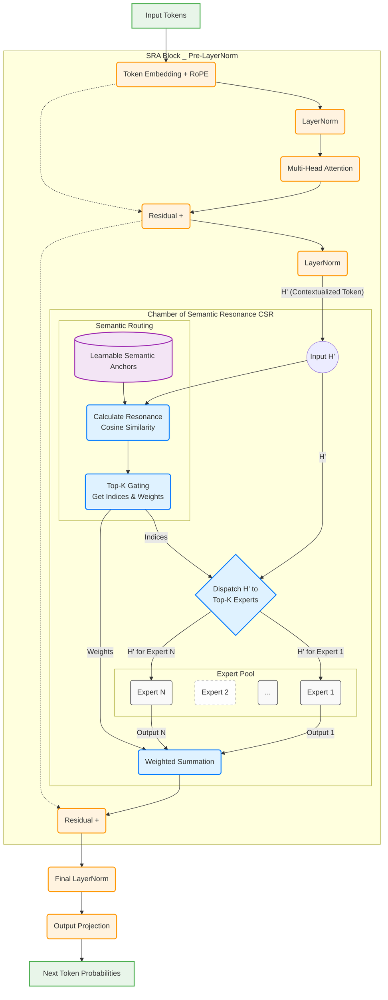

# Semantic Resonance Architecture (SRA)

[](https://www.python.org/downloads/)
[](https://pytorch.org/)
[](https://opensource.org/licenses/Apache-2.0)

A novel mixture-of-experts language model architecture with interpretable semantic routing for improved controllability in critical applications.

**Author**: Ivan Ternovtsii  
**Affiliation**: PhD Student at Uzhhorod National University (UzhNU), Founder and Technical Director at HengeBytes  
**Paper**: TBD (Pending Publication) 

## Key Results

- **5% perplexity improvement** over dense baseline (13.4 vs 14.1 on WikiText-103)
- **Interpretable expert routing** via semantic resonance mechanism  
- **Efficient sparse computation** with top-2 expert selection from 128 experts
- **Clear semantic specialization** of experts (see examples below)

## Architecture Overview

SRA introduces the **Chamber of Semantic Resonance (CSR)** module that replaces standard FFN layers with a mixture of experts routed by semantic similarity:

1. **Semantic Anchors**: 128 learnable vectors representing semantic centroids
2. **Resonance Routing**: Cosine similarity between token representations and anchors
3. **Top-k Selection**: Activate only top-2 experts per token
4. **Weighted Aggregation**: Combine expert outputs with softmax weights



## Project Structure

```
final_code/
├── models/
│   ├── sra.py           # Main SRA model architecture
│   ├── csr.py           # Chamber of Semantic Resonance module
│   └── components.py    # Attention, RoPE, Expert components
├── training/
│   ├── trainer.py       # Training loop and evaluation
│   └── losses.py        # Loss functions (LM, balance, dispersion)
├── scripts/
│   ├── train.py         # Main training script
│   ├── analyze.py       # Expert analysis and visualization
│   ├── model_interpreting_routing_decisions.py  # Expert routing analysis
│   └── prepare_data.py  # Data preprocessing
├── configs/
│   ├── sra_wikitext103.yaml              # SRA configuration
│   └── sra_wikitext103-ablation-ffn-parity.yaml  # Baseline config
├── utils/
│   └── config_utils.py  # Configuration utilities
└── docker/
    ├── Dockerfile
    └── docker-compose.yml
```

## Reproduction Steps

### Option A: Using Docker Compose (Recommended)

#### 1. Prerequisites
- Docker and Docker Compose installed
- NVIDIA Docker runtime for GPU support
- At least 48GB RAM and 1 GPU with 24GB of VRAM

#### 2. Setup Environment Variables
```bash
# Create .env file for Docker Compose
cat > .env << EOF
WANDB_API_KEY=your_wandb_key_here  # Optional, for experiment tracking
HUGGING_FACE_HUB_TOKEN=your_hf_token_here  # Optional, for dataset access
TZ=Europe/Kyiv
EOF
```

#### 3. Build and Start Container
```bash
# Build the Docker image
docker-compose -f docker/docker-compose.yml build

# Start the training service
docker-compose -f docker/docker-compose.yml up -d train

# Enter the container
docker-compose -f docker/docker-compose.yml exec train bash
```

#### 4. Inside Container - Prepare Data and Train
```bash
# Prepare WikiText-103 dataset
python scripts/prepare_data.py --config configs/sra_wikitext103.yaml

# Train SRA model
python scripts/train.py --config configs/sra_wikitext103.yaml

# Train baseline model
python scripts/train.py --config configs/sra_wikitext103-ablation-ffn-parity.yaml
```

The baseline uses FFN dimension 2048 to match SRA's active parameters (2 experts × 1024 dim).

**Multi-GPU training:**
```bash
# For 2 GPUs (adjust batch size in config)
./start_2gpu-ablation-ffn-parity.sh

# For single GPU
./start_1gpu.sh
```

### 5. Analyze Results

```bash
# Generate expert specialization analysis
python scripts/analyze.py \
    --checkpoint ./outputs/sra/best_model.pt \
    --config configs/sra_wikitext103.yaml
```

## Expert Specialization Examples

Our analysis reveals clear semantic specialization patterns. Here are examples from Layer 0:

| Expert | Specialization | Top Tokens |
|--------|---------------|------------|
| E₁ | Temporal/Months | May, March, February, June, April, July, December, January |
| E₁₀ | Prepositions | to, To, for, towards, in, than, of, against |
| E₁₄ | Quotations | ", "..., "[, "', The, D, L |
| E₂₀ | Time Periods | years, months, weeks, later, then, year, decades |
| E₃₅ | Past Tense | was, were, same, became, also, reported |
| E₄₂ | Media/Entertainment | film, game, book, games, movie, novel, films |
| E₄₄ | Articles/Determiners | the, a, The, his, in, two, three, an |
| E₄₆ | Numbers | 1, 2, 11, 7, 9, 3, 19, 13, 14, 23 |
| E₅₇ | Years (1980s) | 1986, 1987, 1984, 2012, 1988, 1985, 1979 |
| E₅₈ | Names | Henry, Edward, Peter, Scott, Robert, Richard |

Full expert analysis available in `results/experts.csv`

## Experimental Results

### Perplexity Comparison

| Model | Configuration | Val PPL | Test PPL | Active Params |
|-------|--------------|---------|----------|---------------|
| Dense Baseline | D=512, FFN=2048, L=4 | 14.13 | 14.10 | 8.9M |
| **SRA (Ours)** | D=512, FFN=1024, E=128, K=2, L=4 | **13.41** | **13.40** | 8.9M |

### Training Progression

The model converges stably with consistent improvement:
- Epoch 1: 15.37 PPL
- Epoch 2: 14.21 PPL  
- Epoch 3: 13.65 PPL
- **Epoch 4: 13.41 PPL** (best)

## Configuration Details

### SRA Model Configuration
```yaml
model:
  d_model: 512
  n_layers: 4
  n_heads: 8
  d_ff: 1024
  max_seq_length: 1024
  
csr:
  enabled: true
  num_experts: 128
  top_k: 2
  anchor_init: orthogonal
  router_noise: 0.1
  
training:
  batch_size: 32
  learning_rate: 3e-4
  warmup_steps: 1000
  max_epochs: 10
```

### Key Hyperparameters
- **Semantic Anchors**: Orthogonal initialization for maximum dispersion
- **Router Noise**: 0.005 during training for exploration
- **Load Balance Weight**: 0.4 to ensure expert utilization
- **Dispersion Weight**: 0.6 for anchor diversity

### Docker Environment Variables

Create `.env` file in project root:
```bash
WANDB_API_KEY=your_key        # For experiment tracking
HUGGING_FACE_HUB_TOKEN=your_token  # For private datasets
TZ=Europe/Kyiv               # Timezone setting
```

## Monitoring

Training metrics are logged to wandb.ai

## Citation

If you use this code in your research, please cite:

```bibtex
@article{ternovtsii2025sra,
  title={Opening the Black Box: Interpretable LLMs via Semantic Resonance},
  author={Ternovtsii, Ivan},
  year={2025},
  url={https://github.com/ITernovtsii/semantic-resonance}
}
```

## License

Apache 2.0 License - see LICENSE file for details.

## Acknowledgments

This research was conducted over a 3-month period as part of PhD studies at Uzhhorod National University. Computational resources were provided by HengeBytes, utilizing 3x RTX 3090 GPUs. Special thanks to:
- WikiText-103 dataset maintainers
- The open-source ML community
- [UzhNU](https://uzhnu.edu.ua/en/) Department of Information Technologies
- [HengeBytes](https://hengebytes.com) team for computational support

## Contact

**Ivan Ternovtsii**
- GitHub: [@ITernovtsii](https://github.com/ITernovtsii)
- Linkedin: [Ivan Ternovtsii](https://www.linkedin.com/in/ivan-ternovtsii-b448a479/)
- Affiliation: PhD Student at Uzhhorod National University, Founder and Technical Director at [HengeBytes](https://hengebytes.com/)
- Research Interests: Interpretable AI, Mixture of Experts, Language Modeling

For questions or collaborations, please open an issue on GitHub or contact via the repository.